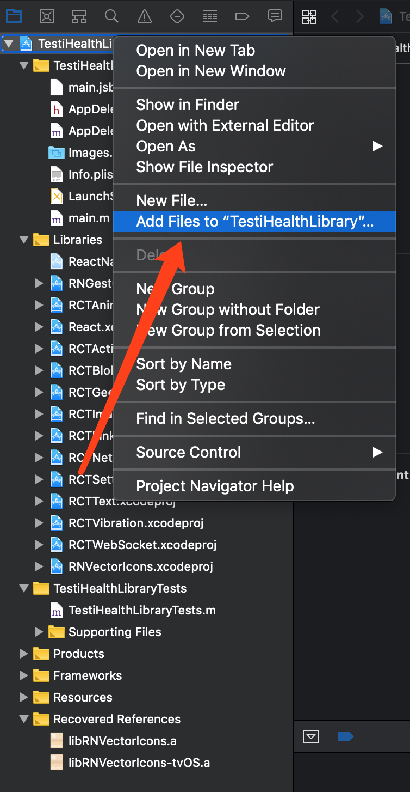
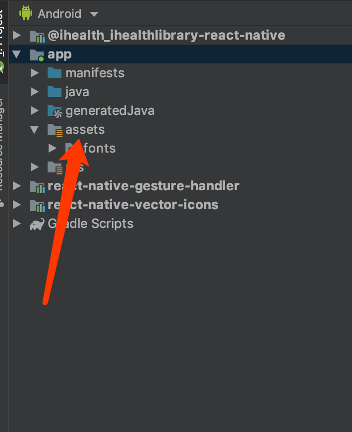

# iHealth device sdk

## Installation

### Using npm

```shell
npm install --save @ihealth/ihealthlibrary-react-native
```

### Using yarn

```shell
yarn add @ihealth/ihealthlibrary-react-native
```

#### Using React Native >= 0.60
Linking the package manually is not required anymore with [Autolinking](https://github.com/react-native-community/cli/blob/master/docs/autolinking.md).

- **iOS Platform:**

  `$ npx pod-install` # CocoaPods on iOS needs this extra step

- **Android Platform with Android Support:**

  Using [Jetifier tool](https://github.com/mikehardy/jetifier) for backward-compatibility if needed

#### Using React Native < 0.60

You then need to link the native parts of the library for the platforms you are using. The easiest way to link the library is using the CLI tool by running this command from the root of your project:

```
react-native link @ihealth/ihealthlibrary-react-native
```

If you can't or don't want to use the CLI tool, you can also manually link the library using the instructions below (click on the arrow to show them):

<details>
<summary>Manually link the library on iOS</summary>

Either follow the [instructions in the React Native documentation](https://facebook.github.io/react-native/docs/linking-libraries-ios#manual-linking) to manually link the framework or link using [Cocoapods](https://cocoapods.org) by adding this to your `Podfile`:

```ruby
pod 'ihealth', :path => '../node_modules/@ihealth/ihealthlibrary-react-native'
```

</details>

<details>
<summary>Manually link the library on Android</summary>

Make the following changes:

#### `android/settings.gradle`
```groovy
include ':ihealthlibrary-react-native'
project(':ihealthlibrary-react-native').projectDir = new File(rootProject.projectDir, '../node_modules/@ihealth/ihealthlibrary-react-native/android')
```

#### `android/app/build.gradle`
```groovy
dependencies {
   ...
   implementation project(':ihealthlibrary-react-native')
}◊
```

#### `android/app/src/main/.../MainActivity.java`
Import iHealth module in your MainActivity.java

```java
protected List<ReactPackage> getPackages() {  
	return Arrays.<ReactPackage>asList(
		new MainReactPackage(),
		new iHealthDeviceManagerPackage()
	);  
}
```
</details>

#### Android permissions

Location permission (in AndroidManifest.xml)

```xml
<!-- Need ACCESS_COARSE_LOCATION or ACCESS_FINE_LOCATION permission in Android API 23+ -->
<uses-permission android:name="android.permission.ACCESS_FINE_LOCATION" />
<uses-permission android:name="android.permission.ACCESS_COARSE_LOCATION" />
```

## Usage

### Authentication

#### Download license file

1. Sign up iHealth developer webside. [Please sign up here](https://dev.ihealthlabs.com)
2. Press "Add New App" button, fill in your information of your app. We will get email and active the license for your app.
3. Download license file, as shown below.


#### Integrate license file

For iOS
As shown below, Add your license file to your iOS project.


For Android
As show below, Add your license file to your asserts folder.


#### Using license file

```js
import { iHealthDeviceManagerModule } from '@ihealth/ihealthlibrary-react-native';

// your license file
const filename = 'license.pem';
iHealthDeviceManagerModule.sdkAuthWithLicense(filename);
```

### Example

iHealth SDK module is based on DeviceEventEmitter, So call add listener while the component is loaded, and call remove listener while the component is unloaded, As shown below

```js
import { DeviceEventEmitter } from 'react-native';
import { iHealthDeviceManagerModule } from '@ihealth/ihealthlibrary-react-native';

componentDidMount() {
    DeviceEventEmitter.addListener(
      iHealthDeviceManagerModule.Event_Authenticate_Result, (event) => {  }
  	);
}

componentWillUnmount() {
    DeviceEventEmitter.removeListener(iHealthDeviceManagerModule.Event_Authenticate_Result);
}
```

#### For bluetooth LE or regular bluetooth device

##### search device

```js
import { iHealthDeviceManagerModule } from '@ihealth/ihealthlibrary-react-native';
const type = 'BP5'; // AM3S, AM4, BG5, BG5S, BP3L, BP5, BP5S, BP7S, HS2, HS4S, PO3,HS2S,BG1S
iHealthDeviceManagerModule.startDiscovery(type);
```

##### connect device

```js
import { iHealthDeviceManagerModule } from '@ihealth/ihealthlibrary-react-native';
const mac = 'xxxxxxxxxxxxxx';
const type = 'BP5'; // AM3S, AM4, BG5, BG5S, BP3L, BP5, BP5S, BP7S, HS2, HS4S, PO3,HS2S,BG1S
iHealthDeviceManagerModule.connectDevice(mac, type);
```

##### device workflow

[AM3S workflow](./doc/am3s.md)
[AM4 workflow](./doc/am4.md)
[BG1 workflow](./doc/bg1.md)
[BG5 workflow](./doc/bg5.md)
[BG5S workflow](./doc/bg5s.md)
[BP3L workflow](./doc/bp3l.md)
[BP5 workflow](./doc/bp5.md)
[BP5S workflow](./doc/bp5s.md)
[BP7S workflow](./doc/bp7s.md)
[HS2 workflow](./doc/hs2.md)
[HS4S workflow](./doc/hs4s.md)
[HS6 workflow](./doc/hs6.md)
[PO3 workflow](./doc/po3.md)
[HS2S workflow](./doc/hs2s.md)
[BG1S workflow](./doc/bg1s.md)
